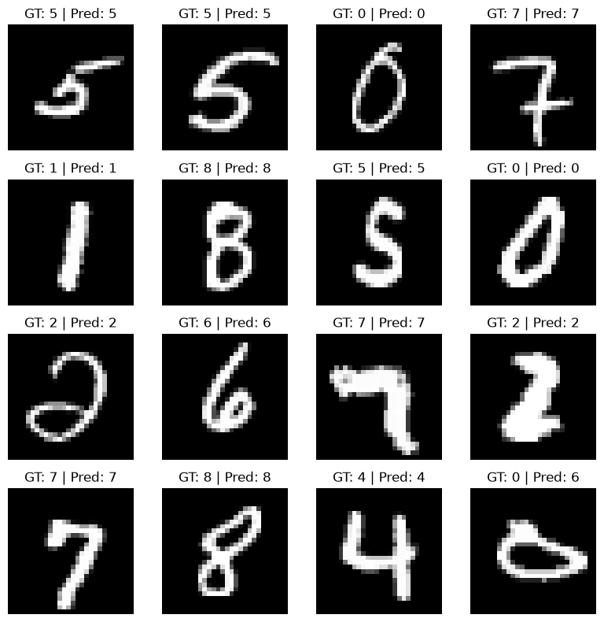

# AI 231 — MNIST Einops/Einsum CNN

This repository contains a three-layer convolutional computation for MNIST classification. All trainable values are plain PyTorch tensors with gradients enabled. Convolution, pooling, flattening, linear classification, and loss are implemented with tensor operations using `einops` and `torch.einsum`; no PyTorch CNN or MLP layer classes are used. The notebook uses CUDA when available and otherwise runs on CPU, where training will be slower.

## Result

- Training: 5 epochs
- Final training accuracy: **98.78%**
- Test accuracy: **98.28%**
- Execution environment: DGX server, one NVIDIA A100 GPU
- Parameters: 21,578

## CNN architecture

| Stage | Output shape |
|---|---:|
| Input | 1 × 28 × 28 |
| Conv1 (3×3, 1→8) + ReLU | 8 × 28 × 28 |
| MaxPool 2×2 | 8 × 14 × 14 |
| Conv2 (3×3, 8→16) + ReLU | 16 × 14 × 14 |
| MaxPool 2×2 | 16 × 7 × 7 |
| Conv3 (3×3, 16→32) + ReLU | 32 × 7 × 7 |
| Flatten | 1,568 |
| Einsum linear classifier | 10 classes |

The executed notebook includes the training output, test accuracy, and a 4×4 grid of 16 test images with their ground-truth and predicted labels.

## Sample predictions



## File

- `mnistclass.ipynb` — complete implementation and saved results

## Run

```bash
python -m pip install -r requirements.txt
jupyter notebook mnistclass.ipynb
```
